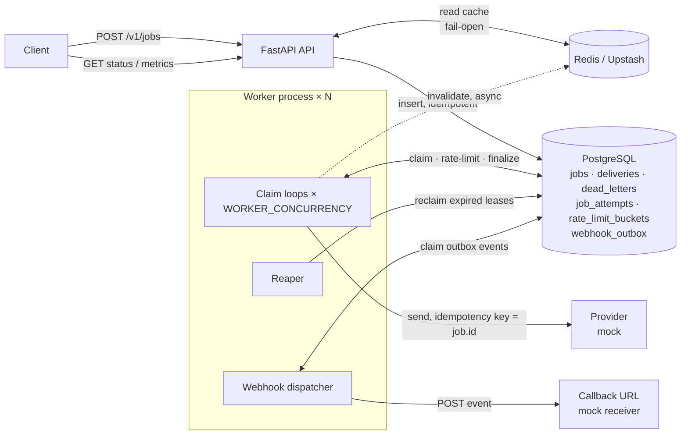
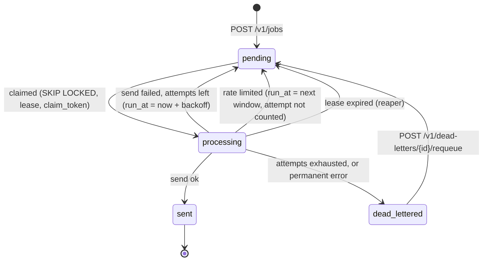

# Notify Queue: Design

## 1. Summary

Notify Queue uses **PostgreSQL as both the source of truth and the queue**.
Workers claim due jobs with `SELECT … FOR UPDATE SKIP LOCKED`. Each claim takes
a lease and a fencing token, and every later write must present that token.
A job's status change, its delivery record, its attempt history and its webhook
event are written in one transaction. **Redis (Upstash) is a read-side cache
only.** It speeds up status, idempotency and metrics reads. No correctness
decision depends on it, and the service keeps running if Redis is down.

The main reason for this choice is that the hard requirements (no duplicate
sends, idempotency, rate limits that hold under concurrency) all come down to
atomic state changes. With one transactional store, each of them is one SQL
statement whose correctness can be checked by reading that statement. The
trade-off is throughput: section 8 covers where this design stops scaling and
what would replace it.

## 2. Architecture

| Component | Responsibility |
|---|---|
| API (`api/`, `services/`) | Validates and schedules jobs (idempotent insert). Serves status, metrics and the dead letter queue. Hosts the mock webhook receiver |
| Claim loop (`worker/loop.py`) | Claims due jobs by priority, applies the rate limit, sends, then records the result with the claim token |
| Reaper (`worker/reaper.py`) | Returns jobs whose worker died (expired lease) to the queue, or dead-letters them at the retry cap |
| Webhook dispatcher (`worker/webhook_dispatcher.py`) | Delivers outbox events to callback URLs, with retries |
| Repository (`repositories/jobs.py`) | **All** concurrency-critical SQL, in one file for review |
| Mock provider (`senders/mock.py`) | Random latency and failure rate. Dedupes on the idempotency key, like SES or Twilio |

Every worker process runs all three loops. They all coordinate through
`SKIP LOCKED`, so there is no leader, no singleton reaper and no single point of
failure among the workers.

### Job lifecycle

"Failed" is not a stored status. A job whose last attempt failed is `pending`
with a `last_error`, waiting to retry. The metrics endpoint reports those jobs
as `failed`. `sent` and `dead_lettered` are the only terminal states.

## 3. Exactly-once delivery

**What is guaranteed:** each job is recorded as delivered exactly once, and the
system never sends it twice unless its worker loses the job mid-send. That can
only happen through a crash, or a send that outlives the lease. In that case the
second send carries the same provider idempotency key (`job.id`), so the
provider does not deliver it again. End to end this is *effectively-once*: true
exactly-once over a network to a third party is impossible without the
provider's cooperation, and the idempotency key is that cooperation. I use the
honest name for it.

### The race conditions, and what closes each one

| # | Race | What would go wrong | How it's closed |
|---|---|---|---|
| 1 | Two workers poll at the same moment | A naive `SELECT … WHERE status='pending'` followed by `UPDATE` lets both read the same row, so both send | Claiming is **one statement**: a CTE with `FOR UPDATE SKIP LOCKED` feeds an `UPDATE … SET status='processing'`. A locked row is skipped, not waited on, and once committed it is no longer `pending`. See `claim_due_jobs` |
| 2 | A worker stalls past its lease, the reaper hands the job to worker B, then A wakes up | A and B both mark it sent (two ledger rows, two webhooks), or A overwrites B's result | Every claim stamps a new `claim_token`. `mark_sent` and `mark_failed` update `WHERE id = … AND claim_token = … AND status = 'processing'`, so A's stale token matches 0 rows and A's result is discarded (**fencing**). `deliveries.job_id` is a primary key as a last backstop |
| 3 | A worker crashes after the provider accepted the send but before it records the result | The job is reclaimed and sent again, so the recipient gets two messages | The sender passes `job.id` as the provider's idempotency key, and the provider absorbs the repeat. `test_crash_after_send_is_not_delivered_twice` walks through this exact sequence |
| 4 | A send times out on our side after the provider has accepted it | Same as 3: counted as a failure, retried | Same as 3. `send_timeout` (10s) is kept well under the lease (30s), so a slow send cannot also lose its claim |
| 5 | The same request is submitted twice, possibly at the same time | Two jobs, so two sends | `idempotency_key` is `UNIQUE`, and the insert is `ON CONFLICT DO NOTHING` followed by a read of the winner. A reuse with a different body (checked by a SHA-256 request hash) returns 409. The test fires 50 identical requests at once and gets exactly one row |
| 6 | Two workers take the last rate-limit slot at the same time | The recipient gets N+1 messages in the window | The check and the increment are one conditional upsert: `ON CONFLICT DO UPDATE SET count = count + 1 WHERE count < :limit`. Only one of the two can succeed |
| 7 | A slow API read writes an old job status into the cache after a worker's update | The status endpoint shows stale data until the TTL runs out | Versioned cache writes (section 6) |
| 8 | A webhook POST succeeds but the dispatcher dies before recording it | The event is delivered twice | Delivery is at-least-once by design. Each event has a stable `event_id`, and receivers dedupe on it (the mock receiver does) |

Transactions are also kept short on purpose. The claim commits *before* any
network I/O, so no row lock is held while the provider is called. The result
is recorded in a second short transaction.

### How it's tested

`tests/test_concurrency.py` runs 1,000 jobs through 20 workers spread over 4
connection pools, and 500 jobs through 4 real OS processes. Both use a 30%
random failure rate so the retry path races too. The mock provider counts
*every* request per job, including duplicates it absorbed. The test asserts:
zero duplicate requests, one provider record and one delivery record per sent
job, no provider record for any dead-lettered job, and every job ends in a
terminal state. A failure message lists the attempt history of any job that
was duplicated.

## 4. Priority queueing

- Priority is stored as a `smallint`: `low=0`, `normal=1`, `high=2`,
  `critical=3`.
- The claim query orders by `priority DESC, run_at ASC`. Among due jobs the
  highest priority goes first, and within one priority the job that has been
  due longest goes first.
- A partial index `ix_jobs_due ON jobs (priority DESC, run_at) WHERE status =
  'pending'` matches that order. It only contains pending rows, so it stays
  small however many sent jobs build up.
- Only **due** jobs compete. A high-priority job scheduled for tomorrow does not
  block a low-priority job that is due now.
- `test_higher_priority_jobs_are_sent_first` checks the order through the real
  worker.

**Limitation:** the priority is strict, so a steady stream of `critical` jobs
could starve `low` jobs indefinitely. The fix I'd make next is aging: order by
`priority + floor(minutes overdue / K)`, with a matching expression index. I
left it out because the brief asks for strict "high before low", and aging
changes that promise.

## 5. Rate limiting (per recipient)

- **Algorithm:** a fixed window, `RATE_LIMIT_PER_HOUR` sends (default 10) per
  recipient per `RATE_LIMIT_WINDOW_SECONDS` (default 3600). The windows are
  aligned to the epoch, so the window start is derived from the database clock
  and is the same for every worker.
- **Where:** after a job is claimed and before it is sent. `try_acquire_rate_limit`
  does the single atomic upsert described in race 6.
- **Over the limit means queued, not failed.** The job goes back to `pending`
  with `run_at` set to the start of the next window. Its attempt counter is
  decremented, so being rate-limited never moves a job towards the dead letter
  queue. No `failed` webhook is sent.
- **Stale windows:** the reaper deletes old window counters.

Trade-offs I accepted:

- **Bursts at window edges.** A fixed window allows up to 2N sends across a
  window boundary. A sliding-window log or a token bucket smooths that, but
  costs more state per recipient. For notification fatigue, the hourly cap was
  the requirement, so fixed windows are enough.
- **A failed send still uses a slot.** The slot is taken before the send, so a
  send that fails still counts. In the demo, one of 14 burst jobs failed after
  taking a slot, so only 9 were sent in that hour. The alternative (give the slot
  back on failure) opens a window in which more than N sends can be in flight at
  once. I chose "never over-send".
- **Claim, then defer.** A rate-limited job is claimed and immediately put back,
  which is wasted work when one recipient has a large backlog. At scale, I'd
  filter those recipients out in the claim query or keep a "blocked until"
  table (section 8).

## 6. Caching with Redis (Upstash)

| What | Key | Pattern | TTL |
|---|---|---|---|
| Job status | `job:{id}` | Cache-aside with versioned writes | 30s while in flight, 24h once terminal |
| Idempotency keys | `idem:{key}` | Written after the insert commits. A hit skips Postgres | 24h |
| Metrics | `metrics:v1` | Short TTL. A `SET NX` lock lets only one caller rebuild it | 2s |

- **Correctness never depends on the cache.** Idempotency is decided by the
  unique constraint, and the cache is only a fast path in front of it. Claims,
  rate limits and delivery records live only in Postgres. Every Redis call goes
  through a fail-open wrapper (`cache/client.py`), which turns any error or
  timeout into a cache miss. There are tests with Redis unreachable and with the
  cache disabled.
- **The stale-write race and the fix.** Plain delete-on-update allows this
  sequence:
  1. A reader loads version 3 of a job.
  2. A worker commits version 4 and deletes the key.
  3. The reader writes version 3 back into the cache.

  Every row has a `version` that each update increments. Cache writes go through
  a Lua script that refuses to overwrite a newer version. Invalidation writes a
  **tombstone** carrying the new version (`"4|"`) instead of deleting the key.
  The late version-3 write is refused (3 < 4), and a reader that loaded version
  4 replaces the tombstone. `test_tombstone_blocks_stale_reader_but_not_fresh_one`
  reproduces the sequence.
- **Invalidation happens after commit, never before,** and in the worker it runs
  as a background task.
- **Measured latency.** From my development machine, one Upstash round trip took
  about 280ms. As a result, cached status reads (250–800ms end to end) were
  *slower* than reads that skipped the cache and went to local Postgres (about
  300ms, and most of that is the cache write that follows the read). That's why
  worker invalidations don't block delivery. The lesson for deployment is that
  the cache only pays off when Redis runs in the same region as the API. From a
  distant region, turn it off with `CACHE_ENABLED=false`.

## 7. Retries, backoff and the dead letter queue

- **Backoff:** exponential with equal jitter. Let `ceiling = min(cap, base ·
  2^(attempt−1))`. The delay is uniform in `[ceiling/2, ceiling]`. With the
  defaults (base 2s, cap 300s), attempts 1–4 wait 1–2s, 2–4s, 4–8s and 8–16s.
  The half-ceiling floor guarantees the delay really grows. The random half
  spreads out jobs that failed together, such as during a provider outage, so
  they don't all retry in the same instant.
- **Cap:** `max_attempts` per job (default 5, and 1–20 per request). When the
  last attempt fails, the job moves to `dead_lettered` in the same transaction
  that records the failure. A `dead_letters` row stores the reason and the last
  error, and a `dead_lettered` webhook is queued.
- **Error classes:**
  - `PermanentDeliveryError` (for example an invalid recipient) dead-letters
    immediately, because retrying cannot help.
  - Any other exception, including timeouts and unexpected bugs, is treated as
    retryable.
- **Poison messages:**
  - A message that makes the sender *raise* is an ordinary failed attempt. It
    retries and then dead-letters, and the worker loop never crashes.
  - A message that makes the worker *die or hang* leaves its lease to expire.
    The reaper counts that as a failed attempt (`lease_expired` in the history),
    so it too reaches the dead letter queue at the cap instead of cycling
    forever.
- **Requeue:** `POST /v1/dead-letters/{id}/requeue` returns a job to the queue
  and raises its cap by `extra_attempts`. The attempt counter keeps counting,
  because it is the job's full history.
- **Webhook retries** use the same backoff (base 1s, cap 300s) for up to 8
  attempts, after which the outbox row is marked `failed`.

## 8. Scaling to millions of jobs and thousands of workers

The first things to break, in the order I'd expect them to:

1. **Database connections.** Each worker process holds a pool, so thousands
   of workers means thousands of connections, and Postgres is uncomfortable
   past a few hundred.
   - Put PgBouncer in front, in transaction mode. Nothing in this design relies
     on session state. The one catch is asyncpg's prepared-statement cache:
     either disable it, or use PgBouncer 1.21 or later with prepared-statement
     support.
   - Use larger claim batches with fewer loops.
2. **Contention on the claim query.** `SKIP LOCKED` avoids blocking, but
   thousands of pollers all scan the head of the same index.
   - Replace most polling with `LISTEN/NOTIFY` wake-ups.
   - Add back-off for idle pollers.
   - Shard the queue: a partition key such as `hash(recipient) % N`, with
     each worker group owning some shards.
3. **Table and index bloat.** Every job is updated several times, and each
   update leaves a dead row. Millions of rows means heavy vacuum work.
   - Move terminal jobs into an archive table, or partition `jobs` by
     `created_at` and drop old partitions.
   - Tune autovacuum for `jobs`.
   - The partial indexes already keep the hot indexes small.
4. **Hot rate-limit rows.** A single very busy recipient serializes on its
   counter row. Move the counters to Redis (a Lua token bucket) and accept that
   Redis then *is* on the correctness path, with a fallback policy for when it's
   down.
5. **The metrics query** scans `jobs`. The 2s cache hides this at moderate
   scale. Beyond that, maintain counters incrementally, or use estimates for
   the large buckets.

**Beyond a single Postgres:** at hundreds of millions of scheduled jobs or tens
of thousands of sends per second, I'd split scheduling from dispatch.
Postgres (or a timing wheel) would hold the *future* jobs, and a scheduler would
move jobs that are about to become due into a partitioned log (Kafka or SQS
FIFO) keyed by recipient. Consumers would dedupe on `job.id`. Idempotency keys
and the delivery ledger would stay in a transactional store. The principles
carry over unchanged: claim with a fence, record the result with the token, use
the provider idempotency key, and keep the outbox.

## 9. Simplifying assumptions, and why

| Assumption | Why | What production needs |
|---|---|---|
| A single Postgres instance, no replicas | Keeps the correctness argument about one serializable point | A primary with a standby. Status and metrics reads can move to a replica |
| The mock provider stores its log in the same Postgres | Lets tests check "delivered exactly once" by querying | Real SES, Twilio and FCM clients behind the `Sender` protocol, passing `job.id` as their idempotency key |
| Fixed-window rate limit, and a failed send uses its slot | Simplest limiter that is atomic and never over-sends (section 5) | Sliding window or token bucket, if smoothing matters |
| Strict priority, no aging | Matches the brief literally (section 4) | Aging, or per-priority quotas |
| Reaped jobs retry immediately (no backoff) | A lease expiry already cost 30s. Simpler SQL | Backoff on reaped jobs too, if crash loops matter |
| Idempotency keys are global and never expire in Postgres | No authentication, so there's no client to scope them to | Scope keys per API client, and expire them (for example after 24h) |
| No authentication and no webhook signing | Out of scope for the exercise | API keys or OAuth, and HMAC-signed webhook bodies with a timestamp |
| `run_at` comes from the database clock (`now()`), but `send_at` is checked against the API clock with 5s of grace | Avoids clock skew between workers, since only one clock decides what's due | Unchanged |
| Payloads are free-form JSON per channel | The brief doesn't define templates | A schema per channel, plus templating |

## 10. Where to look in the code

| Topic | File |
|---|---|
| Claiming, fencing, retries, dead letters, rate-limit SQL | [`repositories/jobs.py`](src/notify_queue/repositories/jobs.py) |
| Worker flow (claim, rate-limit check, send, record result) | [`worker/loop.py`](src/notify_queue/worker/loop.py) |
| Crash recovery | [`worker/reaper.py`](src/notify_queue/worker/reaper.py) |
| Idempotent scheduling | [`services/scheduler.py`](src/notify_queue/services/scheduler.py) |
| Versioned cache | [`cache/job_cache.py`](src/notify_queue/cache/job_cache.py) |
| Webhook outbox | [`repositories/webhooks.py`](src/notify_queue/repositories/webhooks.py), [`worker/webhook_dispatcher.py`](src/notify_queue/worker/webhook_dispatcher.py) |
| Schema and indexes | [`migrations/versions/0001_initial.py`](migrations/versions/0001_initial.py) |
